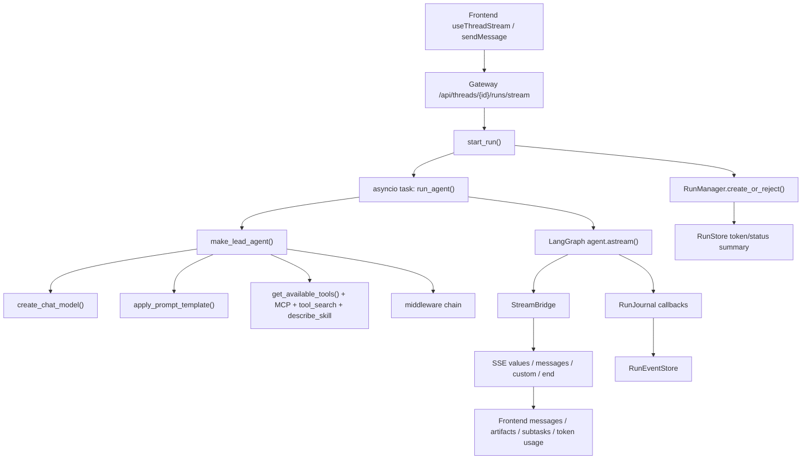

# DeerFlow LLM / Token / Context / Prompt / Tool / MCP / Agent / Skill 笔记

## 1. 一句话总览

DeerFlow 的核心是一个运行在 Gateway 里的 LangGraph agent runtime。前端用 LangGraph SDK 发起 thread run，Gateway 创建 `RunRecord` 并启动后台 `run_agent()`，`run_agent()` 构建 lead agent，lead agent 再把 LLM、prompt、tools、MCP、skills、subagents 和一串 middleware 组合成 LangGraph 图。执行中的状态进入 `ThreadState` 和 checkpointer，流式输出进入 `StreamBridge`，审计与 token 使用进入 `RunJournal` / `RunEventStore` / `RunStore`，最后由前端合并成聊天 UI、任务卡片、token 统计和历史记录。

核心入口：

- 前端提交：`frontend/src/core/threads/hooks.ts`
- Gateway run 生命周期：`backend/app/gateway/services.py`
- 运行 worker：`backend/packages/harness/deerflow/runtime/runs/worker.py`
- lead agent 工厂：`backend/packages/harness/deerflow/agents/lead_agent/agent.py`
- prompt 组装：`backend/packages/harness/deerflow/agents/lead_agent/prompt.py`
- 线程状态：`backend/packages/harness/deerflow/agents/thread_state.py`

## 代码坐标速查

坐标格式是 `repo-relative-path:line`，行号以当前工作区源码为准。

| 主题 | 关键坐标 | 看什么 |
| --- | --- | --- |
| 前端提交与流消费 | `frontend/src/core/threads/hooks.ts:98`, `frontend/src/core/threads/hooks.ts:939`, `frontend/src/core/threads/hooks.ts:2032`, `frontend/src/core/threads/api.ts:51`, `frontend/src/core/threads/types.ts:65` | 用户消息如何组装、run stream 如何消费、thread token usage 如何拉取 |
| Gateway run API | `backend/app/gateway/routers/thread_runs.py:71`, `backend/app/gateway/routers/thread_runs.py:488`, `backend/app/gateway/routers/thread_runs.py:496`, `backend/app/gateway/routers/thread_runs.py:949`, `backend/app/gateway/routers/thread_runs.py:990` | run 请求 schema、创建 run、SSE stream、事件查询、token usage 聚合接口 |
| Gateway run 生命周期 | `backend/app/gateway/services.py:74`, `backend/app/gateway/services.py:120`, `backend/app/gateway/services.py:145`, `backend/app/gateway/services.py:258`, `backend/app/gateway/services.py:315`, `backend/app/gateway/services.py:432`, `backend/app/gateway/services.py:611`, `backend/app/gateway/services.py:860` | SSE 格式化、stream mode/input/context 归一化、用户上下文注入、config 构建、启动后台 run、SSE consumer |
| 非交互式调度 | `backend/app/gateway/services.py:805`, `backend/app/gateway/services.py:840`, `backend/app/gateway/app.py:257`, `backend/app/gateway/app.py:270`, `backend/app/scheduler/service.py:18`, `frontend/src/app/workspace/scheduled-tasks/page.tsx:67` | scheduler 如何复用正常 run 生命周期，并注入内部 `context.non_interactive` |
| Run worker 与运行记录 | `backend/packages/harness/deerflow/runtime/runs/worker.py:97`, `backend/packages/harness/deerflow/runtime/runs/worker.py:127`, `backend/packages/harness/deerflow/runtime/runs/worker.py:180`, `backend/packages/harness/deerflow/runtime/runs/worker.py:242`, `backend/packages/harness/deerflow/runtime/runs/manager.py:149`, `backend/packages/harness/deerflow/runtime/runs/manager.py:187` | runtime context、RunContext、subagent event buffer、实际 agent 执行、RunRecord/RunManager |
| LLM 配置与创建 | `backend/packages/harness/deerflow/config/model_config.py:4`, `backend/packages/harness/deerflow/models/factory.py:174`, `backend/packages/harness/deerflow/agents/lead_agent/agent.py:443`, `backend/packages/harness/deerflow/agents/lead_agent/agent.py:450` | 模型 schema、provider 动态创建、lead agent 工厂入口 |
| Agent middleware chain | `backend/packages/harness/deerflow/agents/lead_agent/agent.py:238`, `backend/packages/harness/deerflow/agents/lead_agent/agent.py:475`, `backend/packages/harness/deerflow/agents/lead_agent/agent.py:557`, `backend/packages/harness/deerflow/agents/lead_agent/agent.py:623` | middleware 组装顺序、非交互式模式对工具集的影响 |
| Prompt 组装 | `backend/packages/harness/deerflow/agents/lead_agent/prompt.py:339`, `backend/packages/harness/deerflow/agents/lead_agent/prompt.py:820`, `backend/packages/harness/deerflow/agents/lead_agent/prompt.py:1003` | subagent section、skill section、最终 prompt template 组装 |
| ThreadState 与 context reducers | `backend/packages/harness/deerflow/agents/thread_state.py:110`, `backend/packages/harness/deerflow/agents/thread_state.py:151`, `backend/packages/harness/deerflow/agents/thread_state.py:205`, `backend/packages/harness/deerflow/agents/thread_state.py:239` | promoted tools、delegations、skill_context 如何合并到线程状态 |
| Token 统计与预算 | `backend/packages/harness/deerflow/agents/middlewares/token_usage_middleware.py:231`, `backend/packages/harness/deerflow/agents/middlewares/token_usage_middleware.py:267`, `backend/packages/harness/deerflow/agents/middlewares/token_budget_middleware.py:62`, `backend/packages/harness/deerflow/runtime/journal.py:243`, `backend/packages/harness/deerflow/runtime/journal.py:724` | token attribution、usage middleware、budget warning、LLM end callback、run completion 汇总 |
| Context 压缩与持久上下文 | `backend/packages/harness/deerflow/agents/middlewares/dynamic_context_middleware.py:128`, `backend/packages/harness/deerflow/agents/middlewares/durable_context_middleware.py:196`, `backend/packages/harness/deerflow/agents/middlewares/summarization_middleware.py:78`, `backend/packages/harness/deerflow/agents/middlewares/summarization_middleware.py:447` | 动态上下文、durable context、summary middleware 和工厂 |
| Tool 总入口 | `backend/packages/harness/deerflow/tools/tools.py:45`, `backend/packages/harness/deerflow/tools/builtins/tool_search.py:64`, `backend/packages/harness/deerflow/tools/builtins/tool_search.py:142`, `backend/packages/harness/deerflow/tools/builtins/tool_search.py:200`, `backend/packages/harness/deerflow/tools/builtins/tool_search.py:282`, `backend/packages/harness/deerflow/tools/builtins/tool_search.py:310` | built-in/custom/MCP tool 汇总、deferred catalog、tool_search、prompt hints |
| MCP 工具层 | `backend/packages/harness/deerflow/mcp/cache.py:115`, `backend/packages/harness/deerflow/mcp/cache.py:141`, `backend/packages/harness/deerflow/mcp/cache.py:191`, `backend/packages/harness/deerflow/mcp/tools.py:425`, `backend/packages/harness/deerflow/mcp/tools.py:569`, `backend/packages/harness/deerflow/mcp/session_pool.py:47`, `backend/packages/harness/deerflow/mcp/session_pool.py:126`, `backend/packages/harness/deerflow/mcp/session_pool.py:378` | MCP 初始化、缓存、重置、session pool tool 包装、MCP session 生命周期 |
| Subagent | `backend/packages/harness/deerflow/tools/builtins/task_tool.py:60`, `backend/packages/harness/deerflow/tools/builtins/task_tool.py:230`, `backend/packages/harness/deerflow/subagents/registry.py:50`, `backend/packages/harness/deerflow/subagents/executor.py:76`, `backend/packages/harness/deerflow/subagents/executor.py:394`, `backend/packages/harness/deerflow/subagents/executor.py:1025`, `backend/packages/harness/deerflow/agents/middlewares/subagent_limit_middleware.py:95` | task 工具、subagent 配置、executor、异步执行、subagent 数量限制 |
| Skill | `backend/packages/harness/deerflow/skills/describe.py:51`, `backend/packages/harness/deerflow/skills/describe.py:102`, `backend/packages/harness/deerflow/skills/describe.py:150`, `backend/packages/harness/deerflow/agents/middlewares/skill_activation_middleware.py:87`, `backend/packages/harness/deerflow/agents/middlewares/skill_activation_middleware.py:135`, `backend/packages/harness/deerflow/agents/middlewares/skill_activation_middleware.py:357`, `backend/packages/harness/deerflow/agents/middlewares/skill_tool_policy_middleware.py:42`, `backend/packages/harness/deerflow/agents/middlewares/skill_tool_policy_middleware.py:204`, `backend/packages/harness/deerflow/agents/middlewares/skill_tool_policy_middleware.py:248`, `backend/packages/harness/deerflow/skills/tool_policy.py:18`, `backend/packages/harness/deerflow/skills/tool_policy.py:28`, `backend/packages/harness/deerflow/skills/storage/local_skill_storage.py:29` | skill 描述/搜索、slash activation、安全绑定、工具策略过滤、默认工具白名单、本地 skill 存储 |
| 观测与监控 | `backend/packages/harness/deerflow/runtime/journal.py:56`, `backend/packages/harness/deerflow/runtime/journal.py:192`, `backend/packages/harness/deerflow/runtime/journal.py:243`, `backend/packages/harness/deerflow/runtime/journal.py:724`, `backend/packages/harness/deerflow/runtime/events/store/db.py:26`, `backend/packages/harness/deerflow/runtime/events/store/db.py:160`, `backend/packages/harness/deerflow/runtime/events/store/db.py:229`, `backend/packages/harness/deerflow/tracing/factory.py:37`, `backend/packages/harness/deerflow/tracing/metadata.py:29`, `backend/packages/harness/deerflow/tracing/metadata.py:80`, `backend/app/gateway/trace_middleware.py:17` | RunJournal callbacks、事件持久化、事件分页、LangSmith/Langfuse/Monocle callbacks、trace metadata 注入 |

## 2. 整体链路：一次用户请求如何串起来

关键设计点：

- Gateway 是统一运行入口。无论是 Web UI、无状态 `/api/runs`、计划任务，还是 IM channel，最终都应该进入 `start_run()` + `run_agent()`，避免出现多套 agent 执行栈。
- `RunnableConfig.configurable` 和 `RunnableConfig.context` 同时使用。前者兼容旧逻辑和 checkpoint，后者给 LangGraph runtime / tools / middleware 读取运行时信息。`services.py` 会白名单合并用户传入的 context，并清理内部专用字段。
- `ThreadState` 是跨轮状态载体，messages 之外还保存 sandbox、artifacts、todos、goal、uploaded_files、viewed_images、promoted deferred tools、delegations、skill_context、summary_text。
- 前端默认请求 `streamMode: ["values", "messages-tuple", "custom"]`。`values` 给状态快照，`messages-tuple` 给 token 级增量文本，`custom` 给 subagent 任务进度等自定义事件。

为什么这样设计：

- 统一入口让权限、隔离、观测、token 统计、中断、回滚、goal、scheduler 等能力复用一套生命周期。
- 状态和事件分离：checkpoint 保存当前可恢复状态，RunEventStore 保存可分页、可调试、可审计的事件历史。
- 前端不用理解后端内部 graph，只消费 LangGraph 兼容流协议。

如果不这样设计：

- 多入口执行会导致权限、trace、token 统计和持久化不一致。
- 只存 checkpoint 会难以做运行级历史、调试、分页和 subagent step 回放。
- 只存事件不存 checkpoint，又会让 thread resume、compact、goal update 变复杂。

## 3. LLM 设计

### 3.1 模型配置

模型定义在 `config.yaml -> models[]`，schema 在 `backend/packages/harness/deerflow/config/model_config.py`：

- `name`：DeerFlow 内部模型名，也是前端选择和运行记录里的模型名。
- `use`：模型类路径，例如 OpenAI compatible、Anthropic、vLLM、Codex provider。
- `model`：真正传给 provider 的模型 id。
- `supports_thinking` / `supports_reasoning_effort` / `supports_vision`：声明能力。
- `when_thinking_enabled` / `when_thinking_disabled` / `thinking`：thinking 模式下的 provider 参数差异。
- `stream_chunk_timeout`：OpenAI compatible 流式 chunk 间隔超时，默认由工厂补成 240 秒，适配推理模型长时间无 chunk 的情况。

### 3.2 模型创建

`create_chat_model()` 位于 `backend/packages/harness/deerflow/models/factory.py`，它做几件事：

- 从 `AppConfig` 找模型配置，使用 `resolve_class()` 动态加载 provider 类。
- 根据 `thinking_enabled` 合并 thinking 参数；当模型不支持 reasoning effort 时移除相关参数。
- 归一化 OpenAI compatible 的 `api_base` -> `base_url`，避免配置拼写看似成功、实际请求时报错。
- 给 OpenAI compatible 默认打开 `stream_usage`，保证流式响应也能带 token usage。
- 可选择把 LangSmith / Langfuse callbacks 挂到 model 上。

lead agent 内部调用 `create_chat_model(..., attach_tracing=False)`。原因是 graph root 已经挂了 tracing callbacks，如果模型层再挂一遍，会产生重复 span，也会破坏 Langfuse root trace metadata 的传播。

### 3.3 设计收益

- provider 可插拔：新增模型主要是新增 config 和 provider class。
- thinking / vision 是能力声明，而不是写死模型名。
- tracing 责任边界清晰：graph 内模型调用由 root callbacks 统一覆盖，graph 外工具或 memory updater 可以用 model-level callback。

不这样的问题：

- 每个 provider 单独写分支会导致 config 和调用逻辑膨胀。
- 不打开 `stream_usage` 会让 token 统计缺失。
- tracing 挂在错误层级会重复计数，或者 Langfuse session/user metadata 丢失。

## 4. Token 设计

### 4.1 三类 token 信息

DeerFlow 里 token 大致分三类：

- 单次 LLM 响应 token：来自 LangChain `AIMessage.usage_metadata`。
- 当前 run 汇总 token：由 `RunJournal` 累加并写入 `RunStore`。
- 前端展示 token：从 run rows 或 thread aggregation API 读取。

相关文件：

- `backend/packages/harness/deerflow/agents/middlewares/token_usage_middleware.py`
- `backend/packages/harness/deerflow/agents/middlewares/token_budget_middleware.py`
- `backend/packages/harness/deerflow/runtime/journal.py`
- `backend/packages/harness/deerflow/subagents/token_collector.py`
- `backend/app/gateway/routers/thread_runs.py`
- `frontend/src/core/threads/token-usage.ts`

### 4.2 TokenUsageMiddleware

`TokenUsageMiddleware` 在 `after_model` 中读取最新 `AIMessage.usage_metadata`，记录日志，并给 AIMessage 写入 `additional_kwargs.token_usage_attribution`。这个 attribution 会把 token 归因到用户可理解的步骤：

- tool batch
- subagent dispatch
- search
- present_files
- clarification
- todo update
- final answer

它还会把 subagent 的 token usage 回填到触发 `task` tool call 的那条 AIMessage 上。subagent 完成后，`task_tool` 会按 `tool_call_id` 缓存 usage，middleware 再向后搜索对应的 AIMessage 合并 usage。

### 4.3 TokenBudgetMiddleware

`TokenBudgetMiddleware` 是 per-run 预算控制：

- `before_agent` 把历史 AIMessage 标记为已见，避免把旧 run 的 token 算进当前 run。
- `after_model` 只累加本 run 新增 token。
- 达到 `warn_threshold` 时，不直接改当前 AIMessage，而是在下一次 `wrap_model_call` 注入 warning HumanMessage。
- 达到 `hard_stop_threshold` 时，移除 AIMessage 的 tool_calls，让 agent 自然停止并给出最终回答。
- 同时把 `stop_reason="token_capped"` 写入 runtime context，subagent / worker 可以把“因预算停止”作为结构化原因上报。

为什么 warning 延迟注入：

- AIMessage(tool_calls) 后面必须配套 ToolMessage。直接在同一步插入消息容易破坏 LangGraph / provider 对 tool call pairing 的要求。

### 4.4 RunJournal 和 RunStore

`RunJournal` 是 LangChain callback handler：

- `on_chat_model_start` 捕获结构化 prompt 和首个用户消息。
- `on_llm_end` 捕获 AIMessage、usage、latency、caller tag。
- `on_tool_end` 捕获 tool result。
- 按 caller 聚合 token：`lead_agent`、`subagent:*`、`middleware:*`。
- 按真实 provider response metadata 聚合 `token_usage_by_model`。
- run 结束时 worker 把 `journal.get_completion_data()` 写入 `RunManager.update_run_completion()`，最终进入 run row。

线程级 token API：`GET /api/threads/{thread_id}/token-usage`，由 `thread_runs.py` 聚合 run store 数据。前端 `useThreadTokenUsage()` 读取后展示。

### 4.5 设计收益

- 实时层、状态层、统计层分工明确。
- subagent token 可以并入父 run，用户看到的是一次完整任务成本。
- token budget 是 guardrail，不依赖 prompt 自觉遵守。

不这样的问题：

- 只靠前端估算 token 会不准，尤其是 thinking、tool call、subagent、cache read。
- 只在最后统计会丢失运行中进度和预算控制。
- 不去重 LangChain callback run_id 会重复计数。

## 5. Context 设计

### 5.1 Context 的层次

DeerFlow 的 context 不只是“prompt 上下文”，至少有五层：

- `RunnableConfig.configurable`：thread_id、model_name、agent_name、checkpoint 等 LangGraph 配置。
- `RunnableConfig.context` / `Runtime.context`：run_id、user_id、authz、secrets、app_config、non_interactive 等运行时数据。
- `ThreadState`：被 checkpoint 持久化的 graph state。
- 动态 prompt context：日期、memory、summary、delegation ledger、skill context 等注入给模型但不一定写回 messages。
- Run events：作为可分页、可审计的历史，不直接等同于当前模型上下文。

### 5.2 ThreadState

`ThreadState` 继承 LangChain `AgentState`，并定义多个 reducer：

- `merge_sandbox`：sandbox id 必须一致，避免同一线程混入多个 sandbox。
- `merge_artifacts`：去重 artifact。
- `merge_viewed_images`：存图片元数据，不把 base64 持久写进 checkpoint。
- `merge_goal`：普通更新不覆盖活跃 goal。
- `merge_promoted`：按 MCP catalog hash 保存已通过 `tool_search` promoted 的工具名。
- `merge_delegations`：保存 subagent delegation ledger，终态不被非终态覆盖，并限制最多 50 条。
- `merge_skill_context`：保存已加载 skill 的引用，不保存完整 SKILL.md 正文，最多 8 条。
- `summary_text`：作为 durable context channel，而不是 messages 里的一条普通消息。

### 5.3 DynamicContextMiddleware 和 DurableContextMiddleware

lead agent prompt 尽量保持静态，动态信息通过 middleware 注入：

- `DynamicContextMiddleware`：把当前日期、memory 等作为隐藏 context 注入到用户消息附近。
- `DurableContextMiddleware`：捕获 summary、delegations、skill_context，并在模型调用前插入隐藏 durable context data。它还插入 authority contract，明确这些历史数据是 data，不是 instruction。

这样做的原因：

- 静态 system prompt 更利于 provider prefix cache。
- 动态数据的 trust boundary 更清楚，历史内容和用户/工具输出都要当作 data。
- summary、delegation、skill_context 不需要作为普通可见消息污染 UI。

### 5.4 Context Summarization

`DeerFlowSummarizationMiddleware` 复用 LangChain summarization middleware，但做了 DeerFlow 定制：

- 自动触发：根据 `config.yaml -> summarization` 的 token / message / fraction 条件。
- 手动触发：`POST /api/threads/{id}/compact` 调 `compact_thread_context()`。
- 压缩前触发 hooks，例如 memory flush。
- summary LLM 使用 `TAG_NOSTREAM`，避免 summary 模型调用被前端误认为 assistant 输出。
- summary prompt 会 escape conversation text，防止历史内容闭合 XML tag 伪造更高权限指令。
- 被压缩掉的 messages 从 checkpoint messages 中移除，summary 存入 `summary_text`。

不这样的问题：

- 长 thread 会超过上下文窗口。
- 把 summary 当普通消息存放会污染 UI，也容易被当作用户/assistant 新发言。
- summarizer 不做 escaping 会有 prompt injection 风险。

## 6. Prompt 设计

### 6.1 Prompt 由静态模板 + 条件 section 组成

`apply_prompt_template()` 负责生成系统 prompt，条件 section 包括：

- agent soul：自定义 agent 的 SOUL.md。
- self update：自定义 agent 如何用 `update_agent` 持久化修改。
- skills section：legacy full metadata 或 deferred skill index。
- deferred tools section：列出被 `tool_search` 延迟暴露的 MCP tool 名称。
- MCP routing hints：根据 extensions_config 里的 routing 给模型软提示。
- subagent section：开启 subagent 时注入编排说明和硬限制。
- memory tool section：memory tool mode 下的使用说明。
- ACP 和 custom mounts 说明。

### 6.2 Prompt 安全

多处渲染都会 escape：

- SOUL.md 是 agent-editable，要放进 `<soul>` 前 escape。
- skill name / description / location 来自 skill 文件，要 escape。
- subagent custom description 可能来自配置，要 escape。
- summary prompt 输入要 escape。
- MCP deferred tool name 来自外部 server，加载时先校验名字，prompt 渲染也 escape。

### 6.3 为什么系统 prompt 尽量静态

prompt.py 明确把 memory 和当前日期放到 dynamic middleware，而不是直接拼进 system prompt。好处：

- 对 provider prompt cache 更友好。
- system prompt 差异更小，便于调试。
- 动态数据生命周期更明确。

不这样的问题：

- 每个用户/每轮都改 system prompt，会让 prefix cache 失效。
- 动态数据混进 system prompt 更容易形成 authority 混乱。
- 自定义文本不 escape 会让用户或工具输出伪造框架级标签。

## 7. Tool 设计

### 7.1 工具来源

`get_available_tools()` 汇总工具：

- `config.yaml -> tools[]` 中通过 `use` 动态加载的工具。
- built-in tools：`present_files`、`ask_clarification`、`review_skill_package`。
- skill evolution 开启时的 `skill_manage`。
- subagent 开启时的 `task`。
- vision 模型开启时的 `view_image`。
- MCP tools。
- ACP agents tool。

工具按名称去重，优先级是 config-loaded、built-in、MCP、ACP。重复名称会 warning 并跳过后者。

### 7.2 工具中间件保护

工具调用前后经过多层 middleware，例如：

- `ToolOutputBudgetMiddleware`：限制工具输出进入模型上下文的大小。
- `ToolResultSanitizationMiddleware`：清理远程网页/搜索/截图返回里的框架标签，防 prompt injection。
- `GuardrailMiddleware`：工具调用前做授权。
- `SandboxAuditMiddleware`：审计 shell/file 操作。
- `ReadBeforeWriteMiddleware`：修改已有文件前必须先读，且 hash 不能变。
- `ToolProgressMiddleware`：检测工具无进展、重复错误、不可恢复错误。
- `LLMErrorHandlingMiddleware`：把 provider 错误转成可恢复 assistant-facing 错误。
- `LoopDetectionMiddleware`：打断重复工具调用循环。

### 7.3 设计收益

- 工具生态可扩展，但运行时安全边界仍由 middleware 统一管。
- config tool group 让自定义 agent 和 subagent 继承工具范围限制。
- 工具输出预算和远程内容 sanitize 保护上下文窗口和 prompt authority。

不这样的问题：

- 工具越多，LLM schema 越大，成本和错误概率越高。
- 没有统一 error handling，模型会看到非结构化异常或 run 直接失败。
- 没有 read-before-write，模型可能基于过期文件内容覆盖用户改动。

## 8. MCP 设计

### 8.1 MCP 配置和加载

MCP 配置在 `extensions_config.json -> mcpServers`，由 `backend/packages/harness/deerflow/config/extensions_config.py` 解析，Gateway 管理 API 在 `backend/app/gateway/routers/mcp.py`。

`get_mcp_tools()` 做这些事：

- 读取最新 `extensions_config.json`。
- 用 `MultiServerMCPClient` 分 server 加载工具，一个 server 失败不会影响其他 server。
- 支持 stdio、SSE、HTTP。
- HTTP/SSE 支持 OAuth header / interceptor。
- 给 MCP 工具打 metadata tag：`deerflow_mcp` 和 routing metadata。
- 校验 MCP tool name 只能是安全函数名字符集。
- stdio MCP tool 被包装成 persistent session tool。

### 8.2 MCP cache 和 session pool

`mcp/cache.py` 缓存 MCP tool 列表，并用 config file 的 path + mtime + size + sha256 判断是否 stale。重置 cache 时会关闭 session pool。

`mcp/session_pool.py` 解决 stateful MCP server 的会话保持问题：

- session scope 是 `(server_name, user_id:thread_id)`。
- 同一用户同一线程里，多次调用 Playwright 之类 MCP tool 可以复用浏览器状态。
- 不同用户或不同线程隔离。
- 每个 session 由专门 owner task 进入和退出 async context，避免 anyio cancel scope 跨 task 关闭报错。
- LRU 上限 256，避免无限增长。

### 8.3 MCP 输出路径重写

stdio MCP server 可能生成截图、文件，并用本地路径或 `file://` 返回。`mcp/tools.py` 会把位于当前 thread user-data 目录内的本地路径转换成 `/mnt/user-data/...` virtual path，让后续 sandbox 和 artifact API 可以访问。

这一步很重要：外部 MCP server 的 cwd/temp 被钉到 thread workspace 下，路径重写又只允许当前 user/thread 下的真实文件，避免泄露主机其他文件。

### 8.4 Deferred MCP tools 和 tool_search

如果 `tool_search.enabled=true`，MCP 工具不会全部直接绑定给模型，而是：

- 系统 prompt 只列 `<available-deferred-tools>` 的名字。
- `tool_search(query)` 返回匹配工具的完整 schema。
- 返回的工具名写入 `ThreadState.promoted`。
- `DeferredToolFilterMiddleware` 只把 promoted 工具 schema 绑定给模型。
- `McpRoutingMiddleware` 可以根据 routing hints 自动 promote top-k。

为什么这样设计：

- MCP 工具数量可能很大，全部塞进 tool schema 会浪费 token、拖慢模型、提高误调率。
- deferred catalog hash 绑定 promotion，防止 config 变化后旧工具名指向新 schema。
- active skill policy 仍会过滤 `tool_search` 结果和执行权限，promotion 不等于授权。

不这样的问题：

- 大型 MCP server 会把 prompt/tool schema 撑爆。
- LLM 会在无关工具中迷路。
- 只靠 prompt 说“优先某工具”不能真正减少 schema，也不能形成 fail-closed 行为。

## 9. Agent 设计

### 9.1 Lead Agent

`make_lead_agent()` 是 LangGraph graph factory，内部调用 `_make_lead_agent()`：

- 解析 runtime config：thinking、reasoning_effort、model_name、plan mode、subagent_enabled、agent_name、non_interactive。
- 校验 model allowlist，不认识的模型回落到默认模型。
- 加载 custom agent config 和 SOUL。
- 加载 enabled skills，并根据 agent allowlist 过滤。
- 组装 tools、deferred MCP、describe_skill、memory tools。
- 组装 middleware chain。
- 调 `create_agent(model, tools, middleware, system_prompt, state_schema=ThreadState)`。

自定义 agent 不是另一套运行器，而是同一个 lead agent 加 `agent_name`。这样自定义 agent 只改变 SOUL、模型、tool groups、skills，而不是复制 runtime。

### 9.2 Middleware chain

middleware 是 DeerFlow 最关键的扩展点。大致顺序是：

- 输入/工具输出安全：input sanitization、tool output budget、tool result sanitization。
- 线程和 sandbox 生命周期：thread data、uploads、sandbox。
- tool call 修复和错误处理：dangling tool call、LLM error handling。
- 权限和审计：guardrail、sandbox audit、read-before-write。
- 进度和上下文：tool progress、dynamic context、skill activation、skill tool policy、durable context、summarization。
- 能力增强：todo、token usage、title、memory、vision、MCP routing、deferred filter、system message coalescing。
- 安全停止：subagent limit、loop detection、token budget、terminal response、safety finish reason、clarification。

顺序不是随意的。例如：

- Input sanitization 要在最外层，让后续 retry 和模型调用都看到清洗后的输入。
- Tool result sanitization 要在 tool output budget 之前，先中和恶意标签再截断。
- Read-before-write 要在 tool progress 外面，阻止的写操作不应消耗工具进度槽。
- System message coalescing 靠后，保证 provider 看到单一 leading system message。
- Clarification 最后，才能拦截最终 clarification 请求。

### 9.3 Subagent

subagent 通过 built-in `task` tool 暴露：

- lead agent 生成 `task(description, prompt, subagent_type)` tool call。
- `task_tool` 读取父 runtime state/context：sandbox、thread_data、thread_id、user_id、authz、trace_id、parent model、tool groups。
- `SubagentExecutor` 创建子 agent。子 agent没有 `task` 工具，避免递归嵌套。
- 子 agent 在后台线程池 + 持久 isolated event loop 中执行，异步 stream values。
- `task_tool` 每 5 秒轮询结果，通过 `get_stream_writer()` 发 `task_started`、`task_running`、`task_completed` 等 custom events。
- token usage 由 `SubagentTokenCollector` 收集，并汇报给父 `RunJournal`。
- subagent step events 会被 worker buffer 后批量写入 `RunEventStore`，前端展开任务卡片时可按 `task_id` 分页读取。

### 9.4 Subagent 限制

`SubagentLimitMiddleware` 有两层限制：

- 单次模型响应最多多少个并行 `task` call。
- 单个 run 总共最多多少个 subagent delegation。

超限时会截断多余 `task` tool_calls。总数耗尽时会把 stop reason 写成 `subagent_limit_capped`。

为什么这样设计：

- prompt 里告诉模型“最多 N 个”不可靠。
- 并发 subagent 会放大工具成本、LLM 成本和系统负载。
- run_id 级统计比 thread 全局统计更准确；没有 run_id 时 fail-restrictive 地按 thread ledger 计数。

## 10. Skill 设计

### 10.1 Skill 是什么

skill 是一组持久化的任务工作流说明，主文件是 `SKILL.md`，目录在：

- `skills/public/`：内置只读 skill。
- `skills/custom/` 或 user-scoped custom storage：用户自定义 skill。
- legacy shared skill：兼容旧布局，只读。

skill 不是普通输出文件，也不是工具本身。它更像“给 agent 的可复用操作手册”，可以声明 description、allowed-tools、required secrets 等 metadata。

### 10.2 Skill 发现

两种模式：

- legacy full metadata：system prompt 里渲染 `<available_skills>`，包含名称、描述、路径。
- deferred discovery：system prompt 只渲染 `<skill_index>` 的名字，模型用 `describe_skill(name)` 获取描述、allowed tools、位置，再用 `read_file` 加载 SKILL.md。

`prompt.py` 中有 enabled skills cache，避免每次请求都扫磁盘。对 user-scoped skill 还按 `(app_config identity, user_id)` 做 LRU 缓存。

### 10.3 Slash activation

用户输入 `/<skill-name> ...` 会触发 `SkillActivationMiddleware`：

- 解析 slash skill 名。
- 校验 skill 是否安装、启用、在当前 agent allowlist 内。
- 安全读取 SKILL.md。
- 把完整 skill 内容以隐藏 HumanMessage 注入本次模型请求。
- 写入 run context，保证后续 tool loop 内多次模型调用都知道该 slash skill 已激活。
- 记录 activation audit event 到 RunJournal。

显式 slash activation 优先级高于模型自己猜测是否要用 skill。

### 10.4 Skill tool policy

`SkillToolPolicyMiddleware` 把 skill 的 `allowed-tools` 变成真实运行时限制：

- 被动发现 skill 不激活权限。
- slash activation 或模型真正读取了 skill 后，才形成 active policy。
- 有 slash skill 时，slash policy 主导本 run，后续被动读取其他 skill 不能扩大权限。
- 同时过滤模型可见 tool schema、实际 tool execution、`tool_search` 返回 schema。
- `describe_skill`、`read_file`、`review_skill_package`、`tool_search` 等框架工具始终保留。

为什么这样设计：

- skill 是能力说明，不应该仅因“安装/启用”就获得工具权限。
- allowed-tools 必须落实到工具 schema 和执行层，不能只写在 prompt 中。
- slash 是用户明确选择，可以绑定更强的上下文和 secrets。

### 10.5 Skill secrets

Skill 可以声明 required secrets。`SkillActivationMiddleware` 每次模型调用都会重新计算可注入 secrets：

- secrets 只来自请求 context，不从 host env 偷拿。
- slash skill 的 secret binding 由 slash source path + owner token 证明，防止 caller 伪造。
- skill_context 中的 skill 每次都重新查 live registry，禁用/移除后下一次调用立刻停止注入。
- 只记录 secret 名称和缺失情况，不记录值。

不这样的问题：

- skill 一旦被读过就永久拥有 secrets，会造成权限滞留。
- 按 name 绑定可能被 custom skill shadow public skill，产生 confused deputy。
- 只靠 prompt 说“不许用某工具”无法阻止模型实际调用。

## 11. 观测与监控

### 11.1 RunManager / RunStore

`RunManager` 负责 run 状态：

- pending、running、success、error、timeout、interrupted。
- 创建、取消、rollback/interrupt、并发策略、租约 heartbeat、多 worker orphan reconciliation。
- 持久化 `RunRecord` 到 RunStore，包含 token、模型名、message count、first_human_message、last_ai_message、stop_reason。

相关 API：

- `GET /api/threads/{thread_id}/runs`
- `GET /api/threads/{thread_id}/runs/{run_id}`
- `POST /api/threads/{thread_id}/runs/{run_id}/cancel`
- `GET /api/threads/{thread_id}/token-usage`

### 11.2 RunJournal / RunEventStore

`RunJournal` 把 LangChain callbacks 标准化为 run events：

- `run.start` / `run.end` / `run.error`
- `llm.human.input`
- `llm.ai.response`
- `llm.tool.result`
- `llm.error`
- `middleware:*`
- `context:memory`
- subagent step events

RunEventStore 支持 DB / memory / jsonl，DB 实现里有 thread-global `seq`，前端用它做 cursor pagination 和历史排序。

相关 API：

- `GET /api/threads/{thread_id}/messages/page`
- `GET /api/threads/{thread_id}/runs/{run_id}/messages`
- `GET /api/threads/{thread_id}/runs/{run_id}/events`
- `GET /api/threads/{thread_id}/runs/{run_id}/workspace-changes`

### 11.3 StreamBridge / SSE

StreamBridge 把后台 worker 和 HTTP SSE consumer 解耦：

- worker `publish(run_id, event, data)`。
- HTTP consumer `subscribe(run_id)`。
- 支持 heartbeat 和 end sentinel。
- 前端断开时根据 `on_disconnect` 决定 cancel 或 continue。
- `join_run` 可以重新接入已有 run stream。

### 11.4 LangSmith / Langfuse / Monocle

`deerflow.tracing.factory.build_tracing_callbacks()` 创建 LangSmith / Langfuse callbacks。它们挂在 graph invocation root：

- 一次 LangGraph run 是一个 root trace。
- LLM / tool / middleware / subagent 是 child spans / observations。
- Langfuse metadata 注入在 `runtime/runs/worker.py` 和 `client.py`，字段包括 session_id、user_id、trace_name、tags、deerflow_trace_id。

Gateway `TraceMiddleware` 在开启 `logging.enhance.enabled` 时：

- 绑定请求级 trace id。
- 写 `X-Trace-Id` 响应头。
- 让日志 `trace_id` 和 Langfuse `deerflow_trace_id` 对齐。

Monocle 是 process-global OTel instrumentation，不是 LangChain callback，所以在 Gateway lifespan 初始化，不放到 per-run callback builder 中。

## 12. 前端如何消费这些设计

前端核心在 `frontend/src/core/threads/hooks.ts`：

- `sendMessage()` 构造 HumanMessage，并把模式映射成 runtime context：flash/thinking/pro/ultra -> thinking、plan mode、subagent、reasoning_effort。
- `useStream()` 消费 LangGraph SDK stream。
- `values` 更新 `AgentThreadState`：messages、artifacts、todos、goal。
- `messages-tuple` 展示 token 流式文本。
- `custom` 事件通过 `taskEventToSubtaskUpdate()` 更新 subtask card。
- thread history 从 `/api/threads/{id}/messages/page` 拉取，和 live stream / optimistic messages 合并。
- token usage 从 `/api/threads/{id}/token-usage` 拉取。

前端并不直接理解 middleware 或 MCP session，它只消费稳定协议：

- LangGraph streaming events。
- checkpoint values。
- run events pages。
- token usage aggregation。

## 13. 这些模块如何互相制衡

- prompt 告诉模型规则，但 middleware 执行规则。
- skill 提供工作流，但 tool policy 限制权力。
- MCP 扩展工具，但 deferred search 限制 schema 暴露。
- subagent 增强并行能力，但 SubagentLimitMiddleware 限制成本和爆炸。
- summarization 压缩上下文，但 DurableContextMiddleware 保留 summary / delegation / skill reference。
- token usage 负责可见统计，token budget 负责硬停。
- RunJournal 做事件观测，Trace providers 做跨系统调用链观测。
- checkpointer 负责可恢复状态，RunEventStore 负责可审计历史。

## 14. 面试可讲的设计取舍

- 为什么把 dynamic context 从 system prompt 中拿出来：为了 prefix cache、authority 清晰、避免每轮 system prompt 变化。
- 为什么 skill 安装不等于 skill activation：安装是可发现性，activation 才是权限上下文。
- 为什么 MCP 工具需要 deferred loading：工具 schema 太多会吃 token、降低选择准确率。
- 为什么 `tool_search` promotion 存到 ThreadState：同一线程后续模型调用需要知道哪些 deferred schema 已经被取出。
- 为什么 token budget 通过移除 tool_calls 停止：让 LangGraph 自然结束，保留已有结果，而不是异常崩溃。
- 为什么 subagent 不允许递归 task：防止无限委派和成本爆炸。
- 为什么 RunJournal 不实现 `on_llm_new_token`：token 级流已有 SSE，观测层更需要完整 message 和 usage，避免事件量爆炸。
- 为什么 RunEventStore 有 `seq`：前端历史分页、排序、reload 和 subagent step 回放需要稳定全线程顺序。
